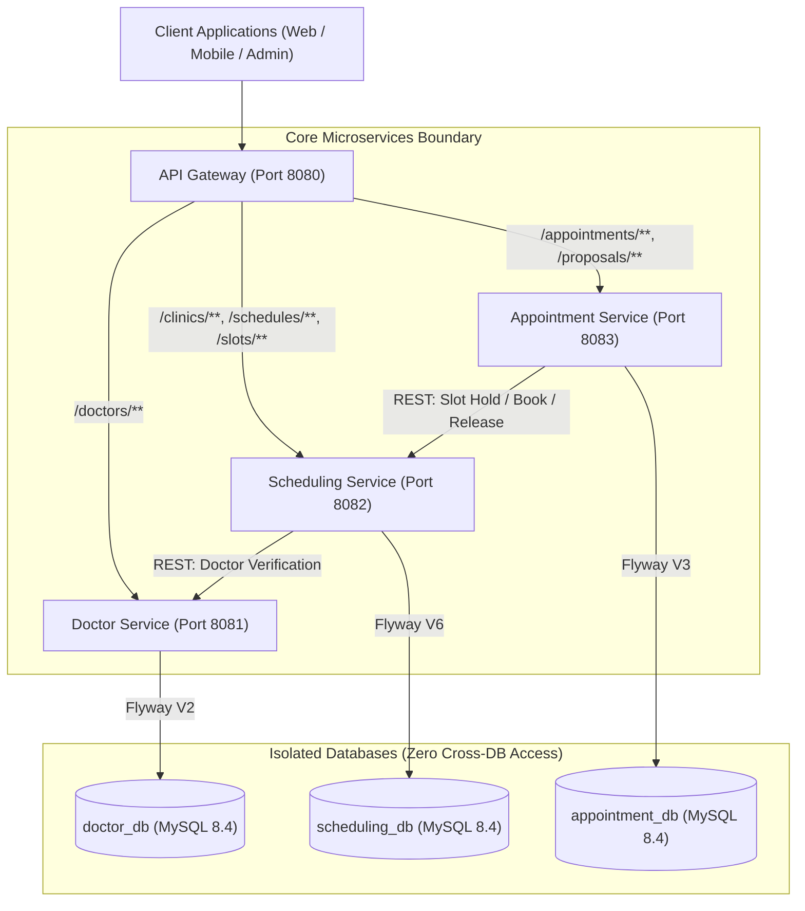
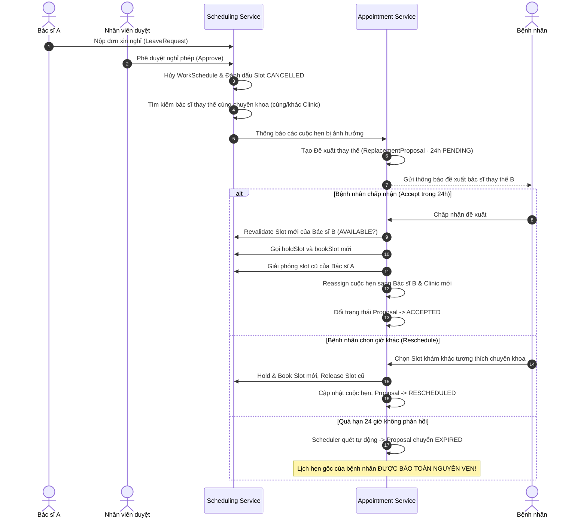
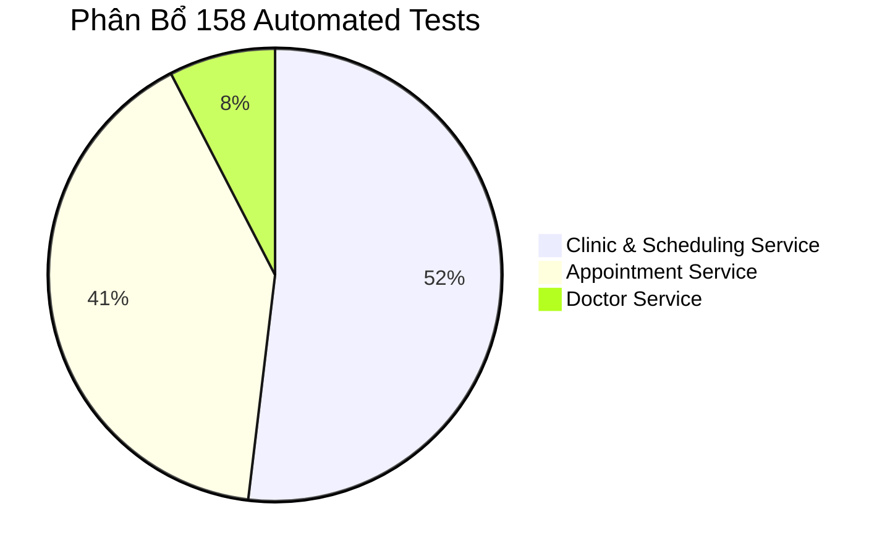

# BÁO CÁO TOÀN DIỆN DỰ ÁN MEDIQ
## HỆ THỐNG QUẢN LÝ CHUỖI PHÒNG KHÁM ĐA KHOA THÔNG MINH (CLINIC MANAGEMENT PLATFORM)

> **Phiên bản tài liệu:** 1.0.0  
> **Ngày lập báo cáo:** 22/09/2026  
> **Trạng thái phát triển:** Hoàn thành Giai đoạn Core Microservices (TODO-001 đến TODO-026)  
> **Chất lượng kiểm thử:** 158/158 Tests PASS (100% Success Rate)

---

## MỤC LỤC

1. [Tổng quan Dự án](#1-tổng-quan-dự-án)
2. [Kiến trúc Kỹ thuật & Công nghệ](#2-kiến-trúc-kỹ-thuật--công-nghệ)
3. [Mô hình Nghiệp vụ & Dữ liệu Cốt lõi](#3-mô-hình-nghiệp-vụ--dữ-liệu-cốt-lõi)
4. [Các Quy trình Nghiệp vụ Nâng cao (Workflows)](#4-các-quy-trình-nghiệp-vụ-nâng-cao-workflows)
5. [Hạ tầng Giao tiếp & Domain Events](#5-hạ-tầng-giao-tiếp--domain-events)
6. [Danh mục API Endpoints Toàn hệ thống](#6-danh-mục-api-endpoints-toàn-hệ-thống)
7. [Báo cáo Chi tiết Tiến độ 26 Nhiệm vụ (TODO-001 đến TODO-026)](#7-báo-cáo-chi-tiết-tiến-độ-26-nhiệm-vụ-todo-001-đến-todo-026)
8. [Báo cáo Đảm bảo Chất lượng & Kiểm thử (QA & Test Report)](#8-báo-cáo-đảm-bảo-chất-lượng--kiểm-thử-qa--test-report)
9. [Hướng dẫn Khởi chạy & Vận hành (Operations Manual)](#9-hướng-dẫn-khởi-chạy--vận-hành-operations-manual)
10. [Kế hoạch Phát triển Giai đoạn Tiếp theo (Next Roadmap)](#10-kế-hoạch-phát-triển-giai-đoạn-tiếp-theo-next-roadmap)

---

## 1. TỔNG QUAN DỰ ÁN

### 1.1. Mục tiêu và Tầm nhìn
**MEDIQ** là giải pháp nền tảng phần mềm quản lý chuỗi phòng khám y tế đa cơ sở, được thiết kế theo phong cách kiến trúc phân tán (Microservices) nhằm giải quyết triệt để các bài toán hóc búa trong ngành y tế tư nhân:
- **Tối ưu hóa nguồn lực bác sĩ**: Bác sĩ có thể linh hoạt khám chữa bệnh tại nhiều phòng khám trực thuộc mà không bị ràng buộc tĩnh với bất kỳ phòng khám hay phòng bệnh cố định nào.
- **Tránh xung đột lịch khám tuyệt đối**: Chống trùng lặp thời gian làm việc của bác sĩ và phòng khám y tế (`Doctor/Room Overlap Protection`).
- **Bảo vệ toàn vẹn lịch hẹn bệnh nhân**: Đặt chỗ (`Hold Slot`) có kiểm soát thời gian hết hạn (10 phút), ngăn chặn tình trạng `Race Condition` và `Double-Booking` bằng cơ chế khóa bi quan (`PESSIMISTIC_WRITE`).
- **Quy trình xử lý biến động lịch linh hoạt (Resilience Workflows)**: Khi bác sĩ có lịch nghỉ đột xuất, hệ thống tự động tìm kiếm bác sĩ thay thế tương thích chuyên khoa (cùng hoặc khác phòng khám), tạo phương án thay thế gửi bệnh nhân xác nhận trong 24 giờ mà vẫn bảo toàn an toàn tuyệt đối lịch hẹn gốc.

### 1.2. Phạm vi Hệ thống Hiện tại
Hệ thống tập trung hoàn thiện 3 dịch vụ xương sống:
1. **Doctor Service** (Port `8081`): Quản lý hồ sơ bác sĩ, chứng chỉ, chuyên khoa và chuyên khoa chính.
2. **Clinic and Scheduling Service** (Port `8082`): Quản lý mạng lưới cơ sở phòng khám, phòng bệnh, lịch làm việc, sinh slots tự động, xin nghỉ phép, đổi ca làm việc và thuật toán gợi ý bác sĩ thay thế.
3. **Appointment Service** (Port `8083`): Quản lý toàn vẹn vòng đời cuộc hẹn, giao dịch giữ chỗ/đặt chỗ, phương án thay thế bác sĩ và lịch sử biến động cuộc hẹn.

---

## 2. KIẾN TRÚC KỸ THUẬT & CÔNG NGHỆ

### 2.1. Ngăn xếp Công nghệ (Tech Stack)
- **Ngôn ngữ lập trình**: Java 21 LTS.
- **Framework nền tảng**: Spring Boot 3.4.3.
- **Quản lý dự án đa module**: Apache Maven (Parent-Module architecture).
- **Hệ quản trị cơ sở dữ liệu**: MySQL 8.4 LTS (mỗi service 1 database độc lập).
- **Database Migrations**: Flyway Migration (V1 -> V6).
- **Tầng dữ liệu (ORM)**: Spring Data JPA / Hibernate 6.6.
- **Mapping & Tiện ích**: MapStruct 1.6.3, Lombok 1.18.36.
- **Giao tiếp liên dịch vụ**: Spring `RestClient` (Synchronous REST with fail-safe resilience).
- **Khung kiểm thử**: JUnit 5, Mockito, AssertJ, Spring WebMvcTest, `MockRestServiceServer`.

### 2.2. Sơ đồ Kiến trúc Tổng thể (Architecture Diagram)



### 2.3. Các Nguyên tắc Thiết kế Bất biến (Design Decisions)
1. **D001 - Database Ownership Tuyệt đối**: Mỗi dịch vụ chỉ đọc/ghi duy nhất trên database của chính mình. Nghiêm cấm Foreign Key hoặc JOIN chéo cơ sở dữ liệu giữa các microservices.
2. **D003 - Clean JPA Entities**: Các Entity Java hoàn toàn sạch, không chứa DDL annotations như `nullable = false`, `length = 255`, `unique = true`. Toàn bộ ràng buộc DDL thuộc trách nhiệm duy nhất của Flyway script.
3. **D004 - Separation of Validation**: Tách rời validation nghiệp vụ sang các lớp `Validator` riêng biệt. DTOs không chứa các annotation validation thừa thãi (`@NotNull`, `@NotBlank`) gây lẫn lộn tầng nghiệp vụ.
4. **D018 - Safe Schedule Changes**: Đổi lịch làm việc của bác sĩ bắt buộc qua quy trình phê duyệt (`ScheduleChangeRequest`), không bao giờ cho phép cập nhật lịch làm việc một cách mù quáng khi đã có lịch hẹn đặt trước (`SCHEDULE_HAS_BOOKED_APPOINTMENTS`).
5. **D020, D021, D023 - Domain Event Contract mà không Over-engineering**: Chuẩn hóa Event Envelope mà không áp đặt message broker (Kafka/RabbitMQ) quá sớm khi chưa cần thiết. Sử dụng `SpringEventPublisher` với audit log SLF4J, dễ dàng mở rộng sang AMQP khi có nhu cầu tải thực tế.

---

## 3. MÔ HÌNH NGHIỆP VỤ & DỮ LIỆU CỐT LÕI

### 3.1. Doctor Domain
- **`Doctor`**: Đại diện cho bác sĩ trong hệ sinh thái. Không gắn cứng với bất kỳ Clinic nào. Bác sĩ làm việc tại Clinic thông qua `WorkSchedule`. Trạng thái: `ACTIVE`, `INACTIVE`.
- **`DoctorSpecialty`**: Quan hệ N-N giữa Bác sĩ và Chuyên khoa. Mỗi bác sĩ có thể có nhiều chuyên khoa nhưng **chỉ được có tối đa duy nhất 1 chuyên khoa chính (`isPrimary = true`)**.

### 3.2. Clinic & Scheduling Domain
- **`Clinic`**: Cơ sở khám chữa bệnh thực tế (ví dụ: MEDIQ Quận 1, MEDIQ Cầu Giấy).
- **`Room`**: Phòng khám bệnh cụ thể trong một Clinic. Mỗi phòng gắn liền với một chuyên khoa cố định (`specialtyId`).
- **`WorkSchedule`**: Lịch làm việc đã được phê duyệt của bác sĩ tại một Phòng thuộc một Cơ sở trong một khung giờ cụ thể.
  - *Quy tắc chống trùng lặp (Overlap Rule)*: Một bác sĩ không thể có 2 ca làm việc trùng giờ ở 2 nơi; một phòng khám không thể có 2 bác sĩ cùng sử dụng trong cùng một thời điểm.
- **`Slot`**: Khung giờ khám bệnh cụ thể (mặc định 15 hoặc 30 phút tùy chuyên khoa), được sinh tự động khi duyệt WorkSchedule.
  - *Vòng đời Slot*:
    $$\text{AVAILABLE} \xrightarrow{\text{holdSlot}} \text{HELD (10m)} \xrightarrow{\text{bookSlot}} \text{BOOKED}$$
    $$\text{HELD} \xrightarrow{\text{hết hạn / releaseSlot}} \text{AVAILABLE}$$
    $$\text{BOOKED} \xrightarrow{\text{hủy cuộc hẹn}} \text{AVAILABLE}$$

### 3.3. Appointment Domain
- **`Appointment`**: Cuộc hẹn khám bệnh giữa Bệnh nhân và Bác sĩ. Lưu trữ snapshot bất biến của bối cảnh lịch hẹn (`doctorId`, `clinicId`, `specialtyId`, `roomId`, `slotId`, `date`, `startTime`, `endTime`).
  - *Vòng đời Cuộc hẹn*:
    $$\text{PENDING} \xrightarrow{\text{confirm}} \text{CONFIRMED} \xrightarrow{\text{complete}} \text{COMPLETED}$$
    $$\text{CONFIRMED / PENDING} \xrightarrow{\text{cancel}} \text{CANCELLED}$$
    $$\text{CONFIRMED} \xrightarrow{\text{reschedule}} \text{CONFIRMED (với Slot mới)}$$
- **`AppointmentHistory`**: Bảng ghi vết kiểm toán (Audit Log) theo dõi từng biến động trạng thái cuộc hẹn (`oldValue`, `newValue`, `action`, `changedBy`, `timestamp`).

---

## 4. CÁC QUY TRÌNH NGHIỆP VỤ NÂNG CAO (WORKFLOWS)

### 4.1. Quy trình Đặt lịch & Xác nhận Cuộc hẹn (WF-04 & WF-05)
1. Bệnh nhân chọn một Slot có trạng thái `AVAILABLE`.
2. Appointment Service gọi sang Scheduling Service yêu cầu `holdSlot(slotId)`. Slot chuyển sang `HELD`, thời hạn giữ chỗ mặc định 10 phút (`holdExpiresAt`).
3. Appointment Service tạo bản ghi cuộc hẹn với trạng thái `PENDING`.
4. Bệnh nhân xác nhận cuộc hẹn: Appointment Service gọi `bookSlot(slotId)`. Slot chuyển thành `BOOKED`, cuộc hẹn chuyển sang `CONFIRMED`.
5. *Cơ chế bù trừ (Compensation)*: Nếu thao tác `bookSlot` thất bại, hệ thống tự động gọi `releaseSlot(slotId)` giải phóng slot và hủy cuộc hẹn an toàn.

### 4.2. Quy trình Bác sĩ Nghỉ phép & Đề xuất Thay thế (WF-06 & WF-07)



### 4.3. Quy tắc Bảo vệ Đặc biệt: BR-REPLACEMENT-008 & BR-REPLACEMENT-002
- **Không giữ trước slot thay thế (`BR-REPLACEMENT-002`)**: Trong 24 giờ chờ bệnh nhân phản hồi, slot của bác sĩ thay thế **không bị khóa tĩnh** để tránh lãng phí năng lực khám bệnh của phòng khám.
- **Revalidation & An toàn tuyệt đối (`BR-REPLACEMENT-008`)**: Khi bệnh nhân bấm Chấp nhận, nếu slot thay thế chẳng may đã bị người khác đặt trước (`BOOKED`), hệ thống lập tức từ chối thao tác với mã lỗi `PROPOSED_SLOT_NOT_AVAILABLE` và **bảo toàn nguyên vẹn 100% cuộc hẹn ban đầu**, không để xảy ra tình trạng mất lịch hay corrupt dữ liệu.

---

## 5. HẠ TẦNG GIAO TIẾP & DOMAIN EVENTS

### 5.1. Chuẩn Hóa Cấu Trúc Event Envelope
Toàn bộ sự kiện phát sinh từ tầng nghiệp vụ đều tuân thủ chặt chẽ định dạng Envelope tiêu chuẩn:
```json
{
  "eventId": "c8f0e5b3-3a1b-4f4d-a957-3f3d79f06129",
  "eventType": "Appointment.Reassigned",
  "occurredAt": "2026-09-21T16:40:00Z",
  "source": "appointment-service",
  "version": 1,
  "payload": {
    "appointmentId": "f784d0b1-9f20-41ea-bf59-8646b9a89709",
    "oldDoctorId": "1b9d6bcd-bbfd-4b2d-9b5d-ab8dfbbd4bed",
    "newDoctorId": "9b1deb4d-3b7d-4bad-9bdd-2b0d7b3dcb6d",
    "oldClinicId": "4c9d6bcd-bbfd-4b2d-9b5d-ab8dfbbd4bed",
    "newClinicId": "7d1deb4d-3b7d-4bad-9bdd-2b0d7b3dcb6d"
  }
}
```

### 5.2. Danh sách 13 Domain Events Đã Hoàn Thành

| Microservice | Tên Sự Kiện Miền (Event Type) | Thời Điểm Phát Sinh |
| :--- | :--- | :--- |
| **Scheduling** | `Schedule.Approved` | Khi người quản lý phê duyệt lịch làm việc của bác sĩ |
| **Scheduling** | `Schedule.Cancelled` | Khi lịch làm việc bị hủy (do nghỉ phép hoặc đổi ca) |
| **Scheduling** | `LeaveRequest.Approved` | Khi đơn xin nghỉ phép của bác sĩ được duyệt chính thức |
| **Appointment** | `Appointment.Created` | Khi cuộc hẹn mới được tạo ở trạng thái PENDING |
| **Appointment** | `Appointment.Confirmed` | Khi bệnh nhân xác nhận cuộc hẹn thành công |
| **Appointment** | `Appointment.Cancelled` | Khi cuộc hẹn bị hủy bỏ |
| **Appointment** | `Appointment.Rescheduled` | Khi cuộc hẹn được dời sang ngày/giờ/slot khác |
| **Appointment** | `Appointment.Reassigned` | Khi cuộc hẹn được chuyển sang bác sĩ / phòng khám thay thế |
| **Appointment** | `ReplacementProposal.Created` | Khi phương án bác sĩ thay thế được lập |
| **Appointment** | `ReplacementProposal.Accepted` | Khi bệnh nhân đồng ý với phương án thay thế |
| **Appointment** | `ReplacementProposal.Rescheduled`| Khi bệnh nhân chọn slot khám khác với bác sĩ thay thế |
| **Appointment** | `ReplacementProposal.Cancelled` | Khi bệnh nhân từ chối phương án thay thế |
| **Appointment** | `ReplacementProposal.Expired` | Khi đề xuất quá 24h mà bệnh nhân không phản hồi |

---

## 6. DANH MỤC TEST API ENDPOINTS, POSTMAN PARAMS & PAYLOAD DEMO TOÀN HỆ THỐNG

> [!TIP]
> **Tệp Postman Collection Đã Tạo Sẵn:** Bạn có thể import trực tiếp tệp [MEDIQ_Postman_Collection.json](file:///d:/MEDIQ/docs/MEDIQ_Postman_Collection.json) vào ứng dụng Postman (Nút **Import** -> Chọn file). Bộ sưu tập đã cấu hình sẵn toàn bộ 40 Request, Headers, Query Parameters, Path Variables và Body JSON, chia theo 3 thư mục tương ứng 3 Microservices.

Dưới đây là chi tiết từng Endpoint kiểm thử thực tế trên Postman (Method, URL, Query Params, Path Variables, Headers và Body JSON):

---

### 6.1. Doctor Service (`http://localhost:8081`)

#### 1. Thêm mới bác sĩ (`POST /doctors`)
- **Test URL**: `http://localhost:8081/doctors`
- **Method**: `POST`
- **Headers**: `Content-Type: application/json`
- **Request Body**:
```json
{
  "userId": "11111111-1111-1111-1111-111111111111",
  "fullName": "Bác sĩ Nguyễn Văn An",
  "licenseNumber": "BS-123456"
}
```
> **Lưu ý nghiệp vụ:** `userId` là mã định danh người dùng trong hệ thống tài khoản (bắt buộc). Bác sĩ mới tạo tự động có trạng thái `ACTIVE`.

#### 2. Lấy danh sách toàn bộ bác sĩ (`GET /doctors`)
- **Test URL**: `http://localhost:8081/doctors`
- **URL có bộ lọc trạng thái**: `http://localhost:8081/doctors?status=ACTIVE`
- **Method**: `GET`
- **Response mẫu (200 OK)**: Danh sách bác sĩ kèm chuyên khoa và trạng thái.

#### 3. Lấy chi tiết một bác sĩ (`GET /doctors/{id}`)
- **Test URL**: `http://localhost:8081/doctors/{doctorId}`
  *(Ví dụ: `http://localhost:8081/doctors/3fa85f64-5717-4562-b3fc-2c963f66afa6`)*
- **Method**: `GET`

#### 4. Cập nhật thông tin bác sĩ (`PATCH /doctors/{id}`)
- **Test URL**: `http://localhost:8081/doctors/{doctorId}`
- **Method**: `PATCH`
- **Headers**: `Content-Type: application/json`
- **Request Body**:
```json
{
  "fullName": "Bác sĩ Nguyễn Văn An (CKI Tim Mạch)",
  "status": "ACTIVE"
}
```

#### 5. Gán chuyên khoa cho bác sĩ (`POST /doctors/{id}/specialties`)
- **Test URL**: `http://localhost:8081/doctors/{doctorId}/specialties`
- **Method**: `POST`
- **Headers**: `Content-Type: application/json`
- **Request Body**:
```json
{
  "specialtyId": "a1b2c3d4-e5f6-7890-abcd-ef1234567890",
  "isPrimary": true
}
```

#### 6. Xem danh sách chuyên khoa của bác sĩ (`GET /doctors/{id}/specialties`)
- **Test URL**: `http://localhost:8081/doctors/{doctorId}/specialties`
- **Method**: `GET`

#### 7. Gán hoặc đổi chuyên khoa chính (`POST /doctors/{id}/specialties`)
- **Test URL**: `http://localhost:8081/doctors/{doctorId}/specialties`
- **Method**: `POST`
- **Headers**: `Content-Type: application/json`
- **Request Body**:
```json
{
  "specialtyId": "a1b2c3d4-e5f6-7890-abcd-ef1234567890",
  "isPrimary": true
}
```
> **Lưu ý nghiệp vụ:** Khi gán chuyên khoa với `isPrimary: true`, hệ thống tự động chỉ định đây là chuyên khoa chính duy nhất của bác sĩ (tuân thủ BR-DOCTOR-002).

#### 8. Hủy gán chuyên khoa khỏi bác sĩ (`DELETE /doctors/{id}/specialties/{specialtyId}`)
- **Test URL**: `http://localhost:8081/doctors/{doctorId}/specialties/{specialtyId}`
- **Method**: `DELETE`

---

### 6.2. Clinic & Scheduling Service (`http://localhost:8082`)

#### 1. Tạo phòng khám / chi nhánh mới (`POST /clinics`)
- **Test URL**: `http://localhost:8082/clinics`
- **Method**: `POST`
- **Headers**: `Content-Type: application/json`
- **Request Body**:
```json
{
  "code": "CLINIC-Q1",
  "name": "MEDIQ Clinic Cơ Sở 1 - Bến Thành",
  "address": "123 Nguyễn Thị Minh Khai, Phường Bến Thành, Quận 1, TP.HCM",
  "phone": "02839123456"
}
```

#### 2. Lấy danh sách cơ sở phòng khám (`GET /clinics`)
- **Test URL**: `http://localhost:8082/clinics`
- **Method**: `GET`

#### 3. Lấy chi tiết phòng khám (`GET /clinics/{id}`)
- **Test URL**: `http://localhost:8082/clinics/{clinicId}`
- **Method**: `GET`

#### 4. Khởi tạo danh mục chuyên khoa (`POST /specialties`)
- **Test URL**: `http://localhost:8082/specialties`
- **Method**: `POST`
- **Headers**: `Content-Type: application/json`
- **Request Body**:
```json
{
  "name": "Tim Mạch",
  "description": "Chuyên khoa khám và điều trị các bệnh lý tim mạch lâm sàng",
  "defaultSlotDuration": 30
}
```

#### 5. Xem danh mục chuyên khoa (`GET /specialties`)
- **Test URL**: `http://localhost:8082/specialties`
- **Method**: `GET`

#### 6. Tạo buồng khám bệnh / Room (`POST /clinics/{clinicId}/rooms`)
- **Test URL**: `http://localhost:8082/clinics/{clinicId}/rooms`
- **Method**: `POST`
- **Headers**: `Content-Type: application/json`
- **Request Body**:
```json
{
  "code": "ROOM-101",
  "name": "Phòng Khám Tim 101",
  "specialtyId": "{specialtyId}"
}
```

#### 7. Lấy danh sách phòng theo phòng khám (`GET /clinics/{clinicId}/rooms`)
- **Test URL**: `http://localhost:8082/clinics/{clinicId}/rooms`
- **Method**: `GET`

#### 8. Lập lịch làm việc mới (`POST /work-schedules`)
- **Test URL**: `http://localhost:8082/work-schedules`
- **Method**: `POST`
- **Headers**: `Content-Type: application/json`
- **Request Body**:
```json
{
  "doctorId": "{doctorId}",
  "clinicId": "{clinicId}",
  "specialtyId": "{specialtyId}",
  "roomId": "{roomId}",
  "date": "2026-09-25",
  "startTime": "08:00:00",
  "endTime": "12:00:00"
}
```

#### 9. Phê duyệt lịch làm việc & Tự động sinh Slot (`POST /work-schedules/{id}/approve`)
- **Test URL**: `http://localhost:8082/work-schedules/{scheduleId}/approve`
- **Method**: `POST`
- **Ghi chú**: Tự động chia ca thành các slot 30 phút (`08:00-08:30`, `08:30-09:00`,...) với trạng thái `AVAILABLE`.

#### 10. Hủy lịch làm việc (`POST /work-schedules/{id}/cancel`)
- **Test URL**: `http://localhost:8082/work-schedules/{scheduleId}/cancel`
- **Method**: `POST`

#### 11. Tra cứu danh sách Slot khả dụng (`GET /slots`)
- **Test URL**: `http://localhost:8082/slots?date=2026-09-25&status=AVAILABLE`
- **URL đầy đủ tham số**: `http://localhost:8082/slots?doctorId={doctorId}&clinicId={clinicId}&specialtyId={specialtyId}&date=2026-09-25&status=AVAILABLE`
- **Method**: `GET`

#### 12. Giữ chỗ slot khám (`POST /slots/{id}/hold`)
- **Test URL**: `http://localhost:8082/slots/{slotId}/hold`
- **Method**: `POST`
- **Ghi chú**: Sử dụng khóa bi quan `PESSIMISTIC_WRITE`, giữ chỗ trong 10 phút.

#### 13. Đặt chỗ chính thức slot khám (`POST /slots/{id}/book`)
- **Test URL**: `http://localhost:8082/slots/{slotId}/book`
- **Method**: `POST`

#### 14. Giải phóng slot khám (`POST /slots/{id}/release`)
- **Test URL**: `http://localhost:8082/slots/{slotId}/release`
- **Method**: `POST`

#### 15. Nộp đơn xin nghỉ phép (`POST /leave-requests`)
- **Test URL**: `http://localhost:8082/leave-requests`
- **Method**: `POST`
- **Headers**: `Content-Type: application/json`
- **Request Body**:
```json
{
  "doctorId": "{doctorId}",
  "startDateTime": "2026-09-25T08:00:00",
  "endDateTime": "2026-09-25T17:00:00",
  "reason": "Tham dự hội nghị tim mạch quốc tế tại Singapore"
}
```

#### 16. Phê duyệt đơn nghỉ phép (`POST /leave-requests/{id}/approve`)
- **Test URL**: `http://localhost:8082/leave-requests/{leaveRequestId}/approve`
- **Method**: `POST`
- **Headers**: `Content-Type: application/json`
- **Request Body**:
```json
{
  "reviewedBy": "Trưởng Khoa - Bác sĩ Lê Văn Bình",
  "reason": "Đồng ý cho nghỉ phép tham gia hội thảo khoa học"
}
```

#### 17. Từ chối đơn nghỉ phép (`POST /leave-requests/{id}/reject`)
- **Test URL**: `http://localhost:8082/leave-requests/{leaveRequestId}/reject`
- **Method**: `POST`
- **Headers**: `Content-Type: application/json`
- **Request Body**:
```json
{
  "reviewedBy": "Trưởng Khoa - Bác sĩ Lê Văn Bình",
  "reason": "Khoa không đủ nhân lực trực lâm sàng trong ngày này"
}
```

#### 18. Thuật toán tìm kiếm bác sĩ thay thế (`GET /replacement-doctors`)
- **Test URL**: `http://localhost:8082/replacement-doctors?specialtyId={specialtyId}&date=2026-09-25&startTime=08:00:00&endTime=12:00:00&originalDoctorId={doctorId}&currentClinicId={clinicId}`
- **Method**: `GET`
- **Response**: Trả về danh sách ứng viên bác sĩ phù hợp cùng chuyên khoa, ưu tiên bác sĩ cùng cơ sở (`SAME_CLINIC`) trước, sau đó đến cơ sở lân cận (`DIFFERENT_CLINIC`).

#### 19. Gửi yêu cầu đổi ca trực (`POST /schedule-change-requests`)
- **Test URL**: `http://localhost:8082/schedule-change-requests`
- **Method**: `POST`
- **Headers**: `Content-Type: application/json`
- **Request Body**:
```json
{
  "scheduleId": "{scheduleId}",
  "doctorId": "{doctorId}",
  "requestedStartTime": "09:00:00",
  "requestedEndTime": "13:00:00",
  "requestedRoomId": "{roomId}",
  "reason": "Điều chỉnh lùi ca 1 tiếng để hội chẩn ca bệnh nặng"
}
```

#### 20. Phê duyệt yêu cầu đổi ca trực (`POST /schedule-change-requests/{id}/approve`)
- **Test URL**: `http://localhost:8082/schedule-change-requests/{changeRequestId}/approve`
- **Method**: `POST`
- **Headers**: `Content-Type: application/json`
- **Request Body**:
```json
{
  "reviewedBy": "Phó Giám Đốc Y Khoa",
  "reason": "Phê duyệt đổi khung giờ làm việc"
}
```

---

### 6.3. Appointment Service (`http://localhost:8083`)

#### 1. Đặt lịch hẹn khám mới (`POST /appointments`)
- **Test URL**: `http://localhost:8083/appointments`
- **Method**: `POST`
- **Headers**: `Content-Type: application/json`
- **Request Body**:
```json
{
  "patientId": "e1f2a3b4-5678-90ab-cdef-112233445566",
  "slotId": "{slotId}"
}
```
- **Kết quả**: Hệ thống gọi sang Scheduling Service để giữ chỗ slot (`hold`), lưu cuộc hẹn với trạng thái `PENDING` và snapshot đầy đủ thông tin bác sĩ, phòng, chuyên khoa.

#### 2. Lấy thông tin chi tiết cuộc hẹn (`GET /appointments/{id}`)
- **Test URL**: `http://localhost:8083/appointments/{appointmentId}`
- **Method**: `GET`

#### 3. Xác nhận cuộc hẹn (`POST /appointments/{id}/confirm`)
- **Test URL**: `http://localhost:8083/appointments/{appointmentId}/confirm`
- **Method**: `POST`
- **Kết quả**: Cuộc hẹn chuyển `CONFIRMED`, gọi sang Scheduling Service để khóa `BOOKED` slot.

#### 4. Hủy cuộc hẹn (`POST /appointments/{id}/cancel`)
- **Test URL**: `http://localhost:8083/appointments/{appointmentId}/cancel`
- **Method**: `POST`
- **Headers**: `Content-Type: application/json`
- **Request Body**:
```json
{
  "reason": "Bệnh nhân bận việc gia đình đột xuất"
}
```

#### 5. Đổi lịch hẹn sang Slot khác (`POST /appointments/{id}/reschedule`)
- **Test URL**: `http://localhost:8083/appointments/{appointmentId}/reschedule`
- **Method**: `POST`
- **Headers**: `Content-Type: application/json`
- **Request Body**:
```json
{
  "newSlotId": "{newAvailableSlotId}",
  "reason": "Bệnh nhân muốn chuyển sang khám ca chiều"
}
```

#### 6. Xem lịch sử biến động cuộc hẹn (`GET /appointments/{id}/history`)
- **Test URL**: `http://localhost:8083/appointments/{appointmentId}/history`
- **Method**: `GET`
- **Kết quả**: Danh sách Audit Log ghi vết từng bước (`CREATED`, `CONFIRMED`, `RESCHEDULED`, `REASSIGNED`,...).

#### 7. Lập đề xuất bác sĩ thay thế (`POST /appointments/{id}/replacement-proposals`)
- **Test URL**: `http://localhost:8083/appointments/{appointmentId}/replacement-proposals`
- **Method**: `POST`
- **Headers**: `Content-Type: application/json`
- **Request Body**:
```json
{
  "proposedSlotId": "{replacementDoctorSlotId}"
}
```
- **Kết quả**: Tạo đề xuất ở trạng thái `PENDING` với thời hạn phản hồi đúng 24 giờ.

#### 8. Xem chi tiết đề xuất thay thế (`GET /appointments/{appointmentId}/replacement-proposals/{proposalId}`)
- **Test URL**: `http://localhost:8083/appointments/{appointmentId}/replacement-proposals/{proposalId}`
- **Method**: `GET`

#### 9. Bệnh nhân Chấp nhận bác sĩ thay thế (`POST /replacement-proposals/{id}/accept`)
- **Test URL**: `http://localhost:8083/replacement-proposals/{proposalId}/accept`
- **Method**: `POST`
- **Kết quả**: Revalidate tính khả dụng của slot đề xuất, cập nhật cuộc hẹn sang bác sĩ mới (`REASSIGNED`), phát Domain Event `ReplacementProposal.Accepted`.

#### 10. Bệnh nhân Đổi sang Slot khám khác (`POST /replacement-proposals/{id}/reschedule`)
- **Test URL**: `http://localhost:8083/replacement-proposals/{proposalId}/reschedule`
- **Method**: `POST`
- **Headers**: `Content-Type: application/json`
- **Request Body**:
```json
{
  "newSlotId": "{otherAvailableSlotId}",
  "reason": "Bệnh nhân chọn giờ khám 11:00 thay vì 09:00"
}
```

#### 11. Bệnh nhân Từ chối phương án thay thế (`POST /replacement-proposals/{id}/cancel`)
- **Test URL**: `http://localhost:8083/replacement-proposals/{proposalId}/cancel`
- **Method**: `POST`
- **Kết quả**: Proposal chuyển sang `CANCELLED`, lịch hẹn gốc được giải phóng an toàn hoặc chờ hướng xử lý khác.

#### 12. Kích hoạt quét đề xuất quá hạn 24h (`POST /replacement-proposals/expire-check`)
- **Test URL**: `http://localhost:8083/replacement-proposals/expire-check`
- **Method**: `POST`
- **Ghi chú**: API phục vụ Cron Job / Quản trị viên kích hoạt thủ công, tự động đóng các proposal quá hạn (`EXPIRED`) và **bảo toàn nguyên vẹn lịch hẹn gốc**.

---

### 6.4. Kịch Bản Test Demo Luồng Nghiệp Vụ Hoàn Chỉnh (Step-by-Step Demo Flow)

Người kiểm thử có thể thực hiện kiểm thử thực tế từ đầu đến cuối theo 7 bước sau:

```
[Bước 1: Setup Dữ liệu Nền tảng]
 1. POST http://localhost:8081/doctors (Tạo Bác sĩ A & B)
 2. POST http://localhost:8082/specialties (Tạo Chuyên khoa Tim Mạch)
 3. POST http://localhost:8081/doctors/{id}/specialties (Gán chuyên khoa cho Bác sĩ)
 4. POST http://localhost:8082/clinics (Tạo Phòng khám Quận 1)
 5. POST http://localhost:8082/rooms (Tạo Phòng khám Tim 101)

[Bước 2: Lập & Duyệt Lịch Làm Việc]
 6. POST http://localhost:8082/work-schedules (Lập ca sáng 08:00 - 12:00 cho Bác sĩ A)
 7. POST http://localhost:8082/work-schedules/{id}/approve (Duyệt -> Tự động sinh Slots)

[Bước 3: Tra cứu & Đặt Lịch Hẹn]
 8. GET http://localhost:8082/slots?date=2026-09-25&status=AVAILABLE (Lấy slotId đầu tiên)
 9. POST http://localhost:8083/appointments (Bệnh nhân đặt lịch -> PENDING, slot bị HOLD)
 10. POST http://localhost:8083/appointments/{id}/confirm (Xác nhận -> CONFIRMED, slot BOOKED)

[Bước 4: Bác Sĩ Xin Nghỉ Phép Đột Xuất]
 11. POST http://localhost:8082/leave-requests (Bác sĩ A xin nghỉ ngày 2026-09-25)
 12. POST http://localhost:8082/leave-requests/{id}/approve (Trưởng khoa duyệt nghỉ)

[Bước 5: Tìm Kiếm Bác Sĩ Thay Thế]
 13. GET http://localhost:8082/replacement-doctors/find?... (Tìm được Bác sĩ B cùng chuyên khoa)
 14. Tạo & duyệt lịch cho Bác sĩ B để có slot khám thay thế khả dụng

[Bước 6: Lập Phương Án Thay Thế Cho Bệnh Nhân]
 15. POST http://localhost:8083/appointments/{id}/replacement-proposals (Gửi đề xuất slot của BS B)
 16. GET http://localhost:8083/replacement-proposals/{id} (Kiểm tra đề xuất, thời hạn 24h)

[Bước 7: Bệnh Nhân Chấp Nhận & Hoàn Tất]
 17. POST http://localhost:8083/replacement-proposals/{id}/accept
 18. GET http://localhost:8083/appointments/{id} (Kiểm tra cuộc hẹn đã đổi sang Bác sĩ B)
 19. GET http://localhost:8083/appointments/{id}/history (Xem toàn bộ dòng thời gian đã ghi vết)
```

---

## 7. BÁO CÁO CHI TIẾT TIẾN ĐỘ 26 NHIỆM VỤ (TODO-001 ĐẾN TODO-026)

Tất cả 26 nhiệm vụ kỹ thuật được quản lý và hoàn tất 100% đúng tiến độ và tiêu chuẩn:

| STT | Mã Nhiệm Vụ | Module | Kết Quả Triển Khai | Trạng Thái |
| :---: | :--- | :--- | :--- | :---: |
| 1 | **TODO-001** | Root / DB | Thiết lập Maven đa module, Flyway V1, MySQL 8.4 connection | `DONE` |
| 2 | **TODO-002** | Doctor | Thực thể Doctor, DTO, Mapper, Service, Controller, Flyway V2 | `DONE` |
| 3 | **TODO-003** | Doctor | Quy tắc N-N chuyên khoa, ràng buộc duy nhất 1 chuyên khoa chính | `DONE` |
| 4 | **TODO-004** | Scheduling | Danh mục Specialty, cấu hình thời lượng slot (15/30/45m) | `DONE` |
| 5 | **TODO-005** | Scheduling | Quản lý mạng lưới cơ sở Clinic (chi nhánh) | `DONE` |
| 6 | **TODO-006** | Scheduling | Quản lý Room theo Clinic và gắn với Specialty | `DONE` |
| 7 | **TODO-007** | Scheduling | WorkSchedule, thuật toán phát hiện trùng lặp bác sĩ và phòng | `DONE` |
| 8 | **TODO-008** | Scheduling | Thuật toán sinh Slot tự động, máy trạng thái và giữ chỗ 10m | `DONE` |
| 9 | **TODO-009** | Appointment | Khởi tạo cuộc hẹn, snapshot context, liên kết Slot từ xa | `DONE` |
| 10 | **TODO-010** | Appointment | Đổi lịch khám, hoán đổi slot an toàn, giải phóng slot cũ | `DONE` |
| 11 | **TODO-011** | Scheduling | Bác sĩ xin nghỉ phép, workflow duyệt/từ chối, chặn tự duyệt | `DONE` |
| 12 | **TODO-012** | Scheduling | Hủy ca làm việc và các slot trống khi nghỉ phép được duyệt | `DONE` |
| 13 | **TODO-013** | Scheduling | Thuật toán tìm kiếm bác sĩ thay thế cùng/khác Clinic | `DONE` |
| 14 | **TODO-014** | Appointment | Domain ReplacementProposal, cửa sổ phản hồi 24 giờ | `DONE` |
| 15 | **TODO-015** | Appointment | Bệnh nhân chấp nhận thay thế, revalidate slot, gán lại cuộc hẹn | `DONE` |
| 16 | **TODO-016** | Appointment | Bệnh nhân đổi slot khác khi không ưng ý giờ đề xuất | `DONE` |
| 17 | **TODO-017** | Appointment | Bệnh nhân từ chối đề xuất thay thế | `DONE` |
| 18 | **TODO-018** | Appointment | Scheduler tự động chuyển EXPIRED đề xuất quá 24h, bảo lưu lịch hẹn | `DONE` |
| 19 | **TODO-019** | Scheduling | Đổi lịch làm việc WF-08, chặn đổi khi có lịch hẹn đã đặt trước | `DONE` |
| 20 | **TODO-020** | Scheduling/Appt | RestClient resilience tests với MockRestServiceServer (17 tests) | `DONE` |
| 21 | **TODO-021** | Scheduling/Appt | Hạ tầng phát 13 Domain Events theo Event Envelope chuẩn | `DONE` |
| 22 | **TODO-022** | All Services | 31 MockMvc Controller tests kiểm thử HTTP status và mapping DTO | `DONE` |
| 23 | **TODO-023** | Scheduling | Khóa bi quan `PESSIMISTIC_WRITE` trên Slot, 10 threads chống race | `DONE` |
| 24 | **TODO-024** | Appointment | Khóa bi quan trên Proposal/Appointment, chống double-accept | `DONE` |
| 25 | **TODO-025** | Appointment | 6 E2E Integration tests mô phỏng chu trình thực tế WF-04, 05, 06, 07 | `DONE` |
| 26 | **TODO-026** | Documentation | Đồng bộ toàn bộ tài liệu kiến trúc, CURRENT_STATE, HANDOVER, TODO | `DONE` |

---

## 8. BÁO CÁO ĐẢM BẢO CHẤT LƯỢNG & KIỂM THỬ (QA & TEST REPORT)

### 8.1. Kết Quả Tổng Thể Build & Test Suite
Toàn bộ mã nguồn được biên dịch và kiểm thử tự động thông qua Maven Surefire. Hệ thống đạt độ tin cậy tuyệt đối:
- **Tổng số ca kiểm thử (Tests Run)**: **158 tests**
- **Số ca kiểm thử thất bại (Failures)**: **0**
- **Số ca kiểm thử lỗi (Errors)**: **0**
- **Số ca kiểm thử bị bỏ qua (Skipped)**: **0**
- **Tỷ lệ thành công (Success Rate)**: **100.0%**

```text
[INFO] ------------------------------------------------------------------------
[INFO] Reactor Summary for MEDIQ Microservices 1.0.0-SNAPSHOT:
[INFO] 
[INFO] MEDIQ Microservices ................................ SUCCESS [  0.003 s]
[INFO] Doctor Service ..................................... SUCCESS [  4.910 s]
[INFO] Clinic and Scheduling Service ...................... SUCCESS [  4.669 s]
[INFO] Appointment Service ................................ SUCCESS [  4.507 s]
[INFO] ------------------------------------------------------------------------
[INFO] BUILD SUCCESS
[INFO] Total time: 14.514 s
[INFO] ------------------------------------------------------------------------
```

### 8.2. Phân Bổ Ca Kiểm Thử Theo Module



### 8.3. Điểm Nhấn Kiểm Thử Trọng Yếu
1. **Kiểm thử đa luồng đồng thời (Concurrency & Stress Tests)**:
   - `SlotConcurrencyTest`: 10 threads đồng thời tranh nhau giữ 1 Slot -> Duy nhất 1 thread thành công, 9 threads nhận mã lỗi `SLOT_NOT_AVAILABLE`.
   - `ReplacementProposalConcurrencyTest`: 10 threads đồng thời chấp nhận 1 phương án thay thế -> Duy nhất 1 thread thành công, 9 threads nhận mã lỗi `INVALID_PROPOSAL_STATUS_TRANSITION`.
2. **Kiểm thử khả năng chịu lỗi liên dịch vụ (Client Resilience Tests)**:
   - `DoctorClientImplTest` và `SchedulingClientImplTest` sử dụng `MockRestServiceServer` giả lập các tình huống mất mạng, 404 Not Found, 409 Conflict, 500 Internal Server Error và đảm bảo hệ thống không bị crash đột ngột.
3. **Kiểm thử tích hợp chu trình hoàn chỉnh (End-to-End Workflow Tests)**:
   - Xác nhận chu trình đặt lịch, xác nhận, bù trừ khi lỗi và hủy hẹn giải phóng slot.
   - Xác nhận chu trình thay thế bác sĩ liên phòng khám, bảo vệ an toàn khi slot thay thế bị người khác tranh chấp trước (`BR-REPLACEMENT-008`).

---

## 9. HƯỚNG DẪN KHỞI CHẠY & VẬN HÀNH (OPERATIONS MANUAL)

### 9.1. Yêu Cầu Môi Trường
- **Hệ điều hành**: Windows 10/11, macOS, hoặc Linux.
- **Java**: JDK 21 trở lên (LTS).
- **Docker**: Docker Desktop hoặc Docker Engine để chạy MySQL container.
- **Maven**: Đã tích hợp sẵn Maven Wrapper (`mvnw` / `mvnw.cmd`).

### 9.2. Khởi Chạy Cơ Sở Dữ Liệu
Dự án sử dụng container Docker chạy MySQL 8.4 LTS với 3 schema tách biệt:
```powershell
# Kiểm tra container MySQL đang chạy
docker ps --filter "name=mediq-mysql"

# Nếu container chưa chạy, khởi chạy:
docker start mediq-mysql
```
*Thông tin kết nối*:
- Host: `localhost:3306`
- Username: `root` / Password: `rootpassword`
- Databases: `doctor_db`, `scheduling_db`, `appointment_db`

### 9.3. Chạy Toàn Bộ Test Suite
Để kiểm chứng lại toàn bộ 158 tests trên toàn hệ thống:
```powershell
cd d:\MEDIQ\backend
.\mvnw.cmd test
```

### 9.4. Khởi Chạy Các Microservices
Mở 3 cửa sổ terminal riêng biệt để khởi chạy đồng thời cả 3 microservices:
```powershell
# Terminal 1: Doctor Service (Port 8081)
cd d:\MEDIQ\backend\doctor-service
..\mvnw.cmd spring-boot:run

# Terminal 2: Clinic & Scheduling Service (Port 8082)
cd d:\MEDIQ\backend\scheduling-service
..\mvnw.cmd spring-boot:run

# Terminal 3: Appointment Service (Port 8083)
cd d:\MEDIQ\backend\appointment-service
..\mvnw.cmd spring-boot:run
```

---

## 10. KẾ HOẠCH PHÁT TRIỂN GIAI ĐOẠN TIẾP THEO (NEXT ROADMAP)

Sau khi hoàn tất xuất sắc phần lõi nghiệp vụ và kiểm thử đạt 100%, hệ thống sẵn sàng bước vào các giai đoạn nâng cao:

### Giai đoạn 2: API Gateway & Định Tuyến Tập Trung (Đang triển khai)
- Xây dựng module `api-gateway` dựa trên **Spring Cloud Gateway** (Port `8080`).
- Đóng vai trò Single Entry Point đón toàn bộ lưu lượng từ Client và định tuyến đến 3 services nội bộ.
- Tích hợp CORS Filter toàn cục, Request Tracing & Performance Metrics Filter, Actuator Health Checks.

### Giai đoạn 3: Tự Động Hóa Xử Lý Bất Đồng Bộ (Async Event Consumption)
- Kết nối luồng bất đồng bộ: Khi Scheduling Service duyệt `LeaveRequest.Approved`, Appointment Service tự động lắng nghe sự kiện để truy quét các cuộc hẹn bị ảnh hưởng và tự động sinh `ReplacementProposal` mà không cần gọi thủ công.

### Giai đoạn 4: Đóng Gói Toàn Diện & Triển Khai Docker Compose
- Viết `Dockerfile` tối ưu hóa đa tầng (Multi-stage build) cho từng microservice.
- Viết `docker-compose.yml` hoàn chỉnh: MySQL 8.4 + 3 Services + API Gateway + Healthchecks.
- Cung cấp bộ sưu tập kiểm thử tự động qua Postman / `requests.http` phục vụ demo và bàn giao.

---

> **Kết luận:** Hệ thống MEDIQ đã đạt mức độ hoàn thiện cao, tuân thủ nghiêm ngặt các quy tắc nghiệp vụ y tế, sở hữu mã nguồn sạch, kiến trúc vững chãi, tính toàn vẹn đa luồng được bảo đảm và tài liệu hóa chuẩn mực.
